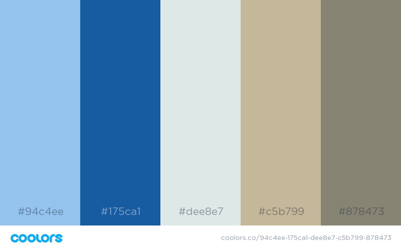

> Spring 2017 | Geography 472/572 | Geovisualization: Geovisual Analytics
>
> Benton County TCI Group
>
> Course Project: Design Scheme
>
> Instructor: Bo Zhao | TA: Kyle R. Hogrefe | Location: LINC 368 | Time: Tuesday/Thursday 9-9:50am

------

## **Color Palette**

------
**Fonts**

Headings: Cormorant Garamond

HTML: 
<link href="https://fonts.googleapis.com/css?family=Cormorant+Garamond" rel="stylesheet"> 

CSS:
font-family: 'Cormorant Garamond', serif;

Paragraphs: Open Sans

HTML:
<link href="https://fonts.googleapis.com/css?family=Open+Sans" rel="stylesheet"> 

CSS:
font-family: 'Open Sans', sans-serif;

------
**Icons**
